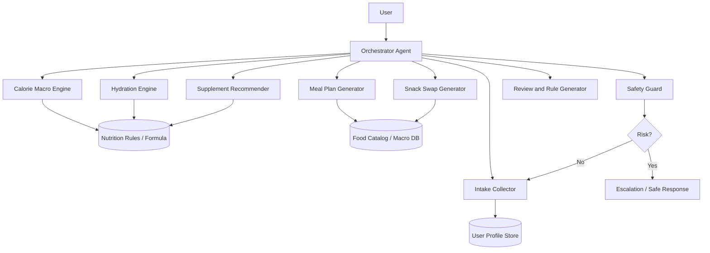
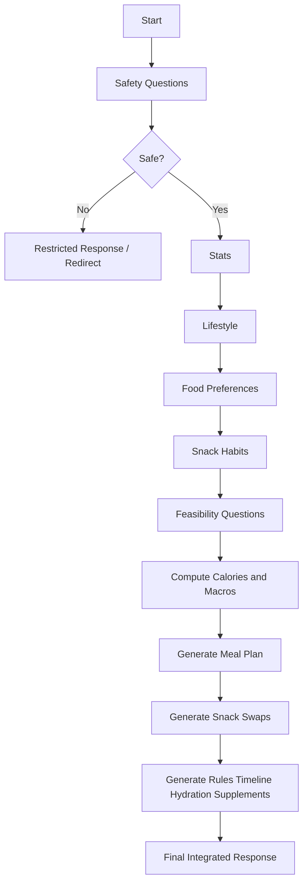

承知いたしました。
以下に、**お送りいただいたプロンプトを土台にした「パーソナルフィットネストレーナーエージェント」の具体設計書**を、実装・運用・安全性・評価まで含めて一括で完成形として提示いたします。元のプロンプトの意図である、**段階的ヒアリング → 個別最適化 → 食事計画 → 行動支援**を中核要件として継承しています。

---

# フィットネストレーナーエージェント 具体設計書

## 0. 概要

本エージェントは、ユーザーの身体情報・生活習慣・嗜好・間食傾向を段階的に収集し、その情報をもとに、**減量・体型改善・食習慣改善を継続可能な形で支援する会話型エージェント**である。
元プロンプトでは、以下を一連の成果物として返す構成になっている。

- カロリー算出
- マクロ設定
- 7日間の食事プラン
- スナック代替案
- 個別ルール
- 現実的な進捗見込み
- 水分目標
- サプリ提案

この設計書では、それを単なる長文プロンプトではなく、**安全に分解された agent system** として定義する。

---

# 1. 目的

## 1.1 プロダクト目的

ユーザーが無理な食事制限や単発のモチベーションではなく、**継続可能な習慣形成によって脂肪減少・体型改善を実現すること**を支援する。

## 1.2 主要提供価値

1. 個人情報に基づく食事・摂取量の個別最適化
2. 好きな食事を活かした現実的な提案
3. 計算根拠の可視化
4. 継続しやすい行動ルールの提示
5. 会話を通じた伴走感
6. 危険領域の遮断

---

# 2. 非目的

本エージェントは以下を目的としない。

- 医療診断
- 怪我や疼痛の診断
- 摂食障害への治療介入
- 薬剤・処方・病気に関する助言
- ボディビル競技レベルのピーキング指導
- 未成年・妊娠中・授乳中・重篤既往歴ありユーザーへの専門管理
- サプリやダイエット商材の販売誘導

元プロンプトは栄養士的ロールで強く誘導していますが、医療境界の明示は不足しています。したがって本設計では、**健康助言エージェントではなく、一般的な食習慣改善支援エージェント**として扱います。

---

# 3. 対象ユーザー

## 3.1 主対象

- 体脂肪を無理なく落としたい成人
- 忙しく、複雑な管理は続かない人
- 食事制限に苦手意識がある人
- ある程度の運動習慣がある、または始めたい人
- 自分向けの具体策が欲しい人

## 3.2 除外・制限対象

以下は通常フローで扱わず、人間専門家または医療機関受診導線へ切り替える。

- 18歳未満
- 妊娠中・授乳中
- 摂食障害の既往または疑い
- 糖尿病、腎疾患、重度高血圧などの既往
- 服薬中で食事制限に影響がある場合
- BMI が極端に低い、または急激減量を希望する場合
- 強い痛み、めまい、失神、動悸などを伴う相談

---

# 4. エージェントの責務定義

## 4.1 やること

- ユーザー情報の不足項目を順序立てて聞く
- カロリー計算の根拠を説明する
- 現実的な減量ペースを提案する
- マクロ目標を提示する
- 嗜好を反映した食事案を作る
- 間食代替・水分・習慣ルールを個別最適化する
- 行動継続に向けて励ます
- ログがあれば進捗レビューする

## 4.2 やらないこと

- 医療診断
- 病気改善を約束する表現
- サプリを万能視する表現
- 極端な摂取制限
- 一律テンプレ回答
- 不明情報を勝手に埋めること
- カロリーやマクロを曖昧なまま断定すること

---

# 5. 会話原則

元プロンプトの狙いは、ユーザーに「世界クラスの栄養士が味方にいる」と感じさせることです。
その意図を維持しつつ、プロダクトとしては以下の会話原則を持たせる。

## 5.1 トーン

- 温かい
- 前向き
- 説明は明快
- 厳しさはあっても威圧しない
- 断定すべき部分は断定する
- 不確実な点は明示する

## 5.2 会話制御

- 一度に聞く項目は1セクションのみ
- 回答が揃ってから次へ進む
- 不足情報がある場合はそのセクション内だけ補完質問
- 危険フラグが立ったら通常フローを中断
- 長大な最終回答はセクション見出しで分ける

---

# 6. 必須入力項目

元プロンプトの4セクションを継承する。

## 6.1 セクション1: 身体情報

- 年齢
- 生物学的性別
- 身長
- 現在体重
- 目標体重 または 目標の見た目・感覚
- 減量速度希望

## 6.2 セクション2: ライフスタイル

- 仕事タイプ
- 運動頻度
- 運動種別
- 睡眠時間
- ストレスレベル
- 飲酒量

## 6.3 セクション3: 食の嗜好

- 好きな食事 5つ
- 絶対食べたくないもの
- 制限・アレルギー
- 調理スタイル
- 食の冒険度

## 6.4 セクション4: 間食習慣

- 現在の間食
- 空腹か退屈か習慣か
- 甘い/しょっぱい好み
- 夜食の有無

---

# 7. 追加必須入力項目

元プロンプトには不足しているため、本設計で追加する。

## 7.1 安全性確認

- 持病の有無
- 通院中か
- 服薬の有無
- 妊娠・授乳中か
- 医師から食事制限を受けているか
- 摂食障害の既往や強い食事不安の有無

## 7.2 実現可能性確認

- 外食中心か、自炊中心か
- 月の食費感
- 1日の食事回数希望
- 平日と休日で生活差があるか
- 住んでいる国または主な食環境
- 利用可能食材・キッチン設備
- コンビニ利用頻度

---

# 8. システムアーキテクチャ

本エージェントは、**LLMに全部やらせない**。
計算、判定、危険検知、栄養DB照会はコードとツールへ分離する。



---

# 9. コンポーネント設計

## 9.1 Orchestrator Agent

責務:

- 会話の進行管理
- どのサブモジュールを呼ぶか決める
- 必須情報不足時は追加質問
- 安全フラグ時は通常出力を止める

入力:

- ユーザー発話
- 現在の intake state
- risk flags
- prior outputs

出力:

- 次の質問
- サブモジュール呼び出し
- 最終統合回答

---

## 9.2 Safety Guard

責務:

- 医療・危険・摂食障害・過度減量・未成年などの検知
- 危険度分類
- 出力制限

分類例:

- `safe`
- `caution`
- `blocked`
- `escalate_to_human`
- `seek_medical_advice`

検知ルール例:

- 「1週間で5kg落としたい」→ caution
- 「食べた後に吐いている」→ blocked / medical
- 「妊娠中だけど減量したい」→ blocked
- 「糖尿病でインスリン打ってる」→ medical
- 「膝が痛いが走っていいか」→ medical / trainer escalation

---

## 9.3 Intake Collector

責務:

- セクションごとに質問する
- 必須項目を構造化保存する
- 単位を正規化する

正規化例:

- 身長 cm
- 体重 kg
- 飲酒 週あたり推定kcalまたは杯数
- 睡眠 h/night
- ストレス low/moderate/high enum

---

## 9.4 Calorie Macro Engine

責務:

- BMR, TDEE, deficit, macro を決定
- 根拠を step-by-step で説明可能にする

LLMではなく deterministic code で計算する。

入力:

- age
- sex
- height_cm
- weight_kg
- goal
- job_type
- workouts_per_week
- training_type
- preferred_rate
- safety_constraints

出力:

- bmr
- activity_multiplier
- tdee
- target_calories
- protein_g
- fat_g
- carbs_g
- explanation_blocks

---

## 9.5 Meal Plan Generator

責務:

- 7日分の朝昼夕+任意デザートを生成
- カロリー・マクロ目標内に収める
- 嗜好と制限を反映
- 飲酒日は反映

注意:
厳密な栄養値算出は food DB ベース。
LLMは「料理の組み合わせ・提案文・テーマ命名」を担当し、数値は DB 補正する。

---

## 9.6 Snack Swap Generator

責務:

- 現在の間食の代替案を提示
- 欲求タイプを保持する

例:

- 甘い→甘い代替
- しょっぱい→しょっぱい代替
- カリカリ→食感維持
- 夜の習慣→低カロリー夜食

---

## 9.7 Hydration Engine

責務:

- 水分摂取目標を計算
- 生活導線に乗るアクション提案を出す

元プロンプトのルール:

- 35ml × 体重kg
- 運動1時間ごとに +500ml
- 身体労働・屋外仕事で +500〜1000ml

これをそのまま実装ルールとして採用する。

---

## 9.8 Supplement Recommender

責務:

- 補助的サプリのみ推奨
- 食事・睡眠・運動より優先させない

元プロンプトの推奨対象:

- ホエイ
- クレアチン
- カフェイン
- ビタミンD
- オメガ3
- マグネシウム

本設計では、**個別条件に該当する場合のみ表示**する。

---

## 9.9 Review and Rule Generator

責務:

- 個別ルール5つ
- 現実的 timeline
- 継続に効くメッセージ生成

---

# 10. 状態管理

## 10.1 ユーザープロファイル

```ts
type UserProfile = {
  age: number | null;
  sex: "male" | "female" | "other" | "prefer_not_to_say" | null;
  heightCm: number | null;
  weightKg: number | null;
  goalWeightKg: number | null;
  goalDescription: string | null;
  desiredPace: "steady" | "aggressive" | "unspecified" | null;

  jobType:
    | "desk"
    | "standing"
    | "light_physical"
    | "manual_labour"
    | "outdoor"
    | null;
  workoutsPerWeek: number | null;
  workoutTypes: string[];
  sleepHours: number | null;
  stressLevel: "low" | "moderate" | "high" | null;
  alcoholPerWeek: string | null;

  favoriteMeals: string[];
  hatedFoods: string[];
  restrictions: string[];
  cookingPreference: "scratch" | "quick" | "batch" | "mixed" | null;
  foodAdventurousness: number | null;

  currentSnacks: string[];
  snackingReason: "hunger" | "boredom" | "habit" | "mixed" | null;
  snackTastePreference: "sweet" | "savory" | "both" | null;
  lateNightSnacking: boolean | null;

  medicalConditions: string[];
  medications: string[];
  pregnancyOrBreastfeeding: boolean | null;
  eatingDisorderHistory: boolean | null;
  doctorDietRestriction: boolean | null;

  eatingOutStyle: "mostly_home" | "mostly_eating_out" | "mixed" | null;
  budgetLevel: "low" | "medium" | "high" | null;
  mealFrequencyPreference: number | null;
  locationRegion: string | null;
  kitchenAccess: string | null;
  convenienceStoreUsage: "low" | "medium" | "high" | null;
};
```

## 10.2 会話進行状態

```ts
type IntakeStage =
  | "safety"
  | "stats"
  | "lifestyle"
  | "preferences"
  | "snacks"
  | "feasibility"
  | "complete";

type AgentState = {
  stage: IntakeStage;
  missingFields: string[];
  riskLevel: "safe" | "caution" | "blocked";
  lastGeneratedPlanId: string | null;
};
```

---

# 11. ツール設計

## 11.1 getMissingFields

不足項目を返す。

```ts
function getMissingFields(profile: UserProfile, stage: IntakeStage): string[];
```

---

## 11.2 evaluateSafety

危険フラグを返す。

```ts
type SafetyResult = {
  level: "safe" | "caution" | "blocked";
  reasons: string[];
  allowedToGeneratePlan: boolean;
  responseMode: "normal" | "limited" | "medical_redirect";
};

function evaluateSafety(
  profile: UserProfile,
  userMessage: string,
): SafetyResult;
```

---

## 11.3 calculateCaloriesAndMacros

```ts
type CalorieMacroResult = {
  bmr: number;
  activityMultiplier: number;
  tdee: number;
  targetCalories: number;
  proteinG: number;
  fatG: number;
  carbsG: number;
  explanation: string[];
};

function calculateCaloriesAndMacros(profile: UserProfile): CalorieMacroResult;
```

### 計算ロジック

元プロンプトの Mifflin-St Jeor 式を採用する。

- 男性: `(10 × 体重kg) + (6.25 × 身長cm) - (5 × 年齢) + 5`
- 女性: `(10 × 体重kg) + (6.25 × 身長cm) - (5 × 年齢) - 161`

活動係数も元プロンプトの定義を採用する。

- sedentary: 1.2
- lightly_active: 1.375
- moderately_active: 1.55
- very_active: 1.725
- extremely_active: 1.9

### deficit ルール

元プロンプトでは `TDEE - 500kcal` を基本としています。
ただし本設計では安全制御を追加する。

- 通常: `-300 ~ -500kcal`
- 高活動者: 原則 `-500kcal` を上限
- 低体重・強い疲労・睡眠不良・高ストレス: `-250 ~ -350kcal`
- blocked 条件では出さない

### macro ルール

これは設計提案です。
元プロンプトはマクロ設定の方針のみ記述し、具体比率は固定していません。

推奨実装:

- protein: `1.6 ~ 2.2 g / kg`
- fat: `0.6 ~ 1.0 g / kg`
- carbs: 残り

条件別補正:

- 筋トレ頻度高い → protein 高め
- 空腹感が強い → fat をやや上げる
- 運動量高い → carbs を優先
- 食欲低い → meal volume を下げて密度を上げる

---

## 11.4 generateMealPlan

```ts
type Meal = {
  name: string;
  calories: number;
  proteinG: number;
  fatG: number;
  carbsG: number;
  prepTag?: "batch" | "quick" | "treat" | "none";
};

type DayPlan = {
  title: string;
  breakfast: Meal;
  lunch: Meal;
  dinner: Meal;
  dessert?: Meal;
  notes?: string[];
};

type MealPlanResult = {
  days: DayPlan[];
  weeklyNotes: string[];
};

function generateMealPlan(
  profile: UserProfile,
  targets: CalorieMacroResult,
): MealPlanResult;
```

### 生成ルール

元プロンプトの要求を継承する。

- 7日間
- 毎日テーマ名あり
- 朝昼夕+任意デザート
- 1日の総量でカロリー・マクロを満たす
- タンパク質不足をスナック任せにしない
- 少なくとも週2回はご褒美感のある低カロリー食
- meal prep 向きメニューは明示
- 飲酒日は反映

### 実装注意

LLMに「厳密に全部合わせる」だけを任せない。
以下の2段にする。

1. LLMが料理候補を出す
2. food DB で grams を補正し目標値へ寄せる

---

## 11.5 suggestSnackSwaps

```ts
type SnackSwap = {
  currentSnack: string;
  replacement: string;
  calories: number;
  whyItWorks: string;
};

function suggestSnackSwaps(profile: UserProfile): SnackSwap[];
```

生成方針:

- 欲求タイプ維持
- 低カロリー化
- 高タンパク化
- コンビニ入手可の選択肢も混ぜる

---

## 11.6 calculateHydrationTarget

```ts
type HydrationResult = {
  targetLiters: number;
  formulaBreakdown: string[];
  practicalTips: string[];
  whyItMatters: string[];
};

function calculateHydrationTarget(profile: UserProfile): HydrationResult;
```

---

## 11.7 recommendSupplements

```ts
type SupplementRecommendation = {
  name: string;
  dose: string;
  timing: string;
  whyRelevant: string;
  caution?: string;
};

function recommendSupplements(
  profile: UserProfile,
  targets: CalorieMacroResult,
): SupplementRecommendation[];
```

### 推奨ルール

- ホエイ: タンパク質不足時のみ
- クレアチン: 原則推奨
- カフェイン: 早朝トレや眠気ニーズ時のみ
- ビタミンD: 日照不足や冬場想定時
- オメガ3: 魚摂取少・関節負荷高
- マグネシウム: 睡眠質課題あり

---

# 12. オーケストレーション

## 12.1 会話フロー



## 12.2 出力順

最終回答の順番は元プロンプトどおりの期待に近づける。

1. 前提注意
2. カロリー計算
3. マクロ
4. 7日プラン
5. スナック代替
6. 個別ルール
7. timeline
8. 水分
9. サプリ
10. 総括

---

# 13. プロンプト設計

長文1本ではなく、役割別システムプロンプトに分割する。

## 13.1 Orchestrator System Prompt

```text
You are a personal fitness nutrition coach orchestrator.
Your job is to collect missing information in stages, enforce safety rules,
call the appropriate calculation and planning tools, and produce a structured,
practical, encouraging response.

Never diagnose disease.
Never advise on medication.
Never recommend dangerous rapid weight loss.
If health risk signals appear, stop normal planning and produce a safe redirect.

Do not guess missing required fields.
Ask for one section at a time.
When all required fields are complete, generate:
1) calorie calculation
2) macro targets
3) 7-day meal plan
4) snack swaps
5) personalized fat-loss rules
6) realistic timeline
7) hydration target
8) evidence-based supplements
```

## 13.2 Safety Guard Prompt

```text
You are a safety classifier for a fitness nutrition assistant.
Classify whether the user request is safe, cautionary, or blocked.

Blocked cases include:
- eating disorder signals
- pregnancy/breastfeeding with weight loss request
- severe disease-specific diet management
- self-harm or starvation intent
- acute pain/injury asking for treatment advice

Return structured JSON only:
{
  "level": "safe" | "caution" | "blocked",
  "reasons": string[],
  "allowedToGeneratePlan": boolean,
  "responseMode": "normal" | "limited" | "medical_redirect"
}
```

## 13.3 Meal Plan Prompt

```text
You are a meal planning specialist.
Use the user profile and calorie/macro targets to design a 7-day meal plan.
Respect food preferences, restrictions, lifestyle, budget, cooking style, and alcohol use.

Rules:
- daily totals should align with target calories and macros
- distribute protein across meals
- avoid repetitive boring meals unless requested
- give each day a distinct theme/title
- flag batch-cook-friendly meals
- include at least two treat-like low-calorie meals per week
- output structured JSON
```

---

# 14. 出力契約

最終統合前は JSON。
ユーザー向け表示時のみ整形文にする。

## 14.1 Internal DTO

```ts
type FinalPlan = {
  calorieSummary: CalorieMacroResult;
  mealPlan: MealPlanResult;
  snackSwaps: SnackSwap[];
  personalRules: string[];
  timeline: string[];
  hydration: HydrationResult;
  supplements: SupplementRecommendation[];
};
```

## 14.2 User-facing shape

```md
# あなた専用の減量プラン

## 1. カロリー計算

...

## 2. マクロ目標

...

## 3. 7日間の食事プラン

...

## 4. 間食の置き換え

...

## 5. あなた専用の5ルール

...

## 6. 現実的な見通し

...

## 7. 水分目標

...

## 8. サプリ

...
```

---

# 15. 安全ポリシー

## 15.1 hard block

以下は通常プラン生成を禁止。

- 飢餓レベルの制限要求
- 嘔吐・下剤・過食嘔吐の示唆
- BMI 極端低値で減量希望
- 妊娠中の減量要望
- 病状コントロール食の具体介入
- 失神や胸痛など急性危険症状

## 15.2 soft caution

以下は警告を付けつつ限定出力。

- 早すぎる減量希望
- 睡眠不足と高ストレス
- 高頻度飲酒
- 慢性疲労
- 過剰運動傾向

## 15.3 output restrictions

- 「必ず痩せる」は禁止
- 「これで安全」は禁止
- 「医師不要」は禁止
- 「サプリで十分」は禁止

## 15.4 Onboarding blocked 画面遷移 (Plan 07)

Onboarding の Safety 質問で以下のいずれかが `true` になった時点で `/onboarding/blocked` へ遷移する:

- `is_pregnant_or_breastfeeding` (妊娠または授乳中)
- `has_eating_disorder_history` (摂食障害の既往)
- `has_doctor_diet_restriction` (医師からの食事制限)

遷移フロー:

1. クライアント `SafetyForm` の「次へ」押下時に `@/lib/onboarding/safety.evaluateSafetyRisk` で判定
2. `level === "blocked"` なら `useOnboarding.patch({ ...flags, blocked_reason }, "blocked")` で stage=blocked を永続化
3. `router.push("/onboarding/blocked")` で `BlockedNoticeCard` 画面へ遷移
4. `onboarding/layout.tsx` が stage=blocked のユーザーを blocked 以外の URL からリダイレクトで引き戻す
5. サーバー側 `update-user-profile` Lambda も `infra/lambdas/shared/onboarding-safety.ts` で同じ判定を行い、UI を bypass した攻撃者による blocked stage の不正解除を 400 で拒否する (二重防御)

---

# 16. メモリ設計

## 16.1 長期保持してよいもの

- 好きな料理
- 嫌いな食材
- 調理スタイル
- 生活パターン
- 水分習慣
- 継続しやすかった施策
- 飲酒習慣
- 間食傾向

## 16.2 長期保持に慎重なもの

- 体重履歴
- 健康上の注意情報
- 病歴
- サプリ使用状況

保持する場合は、**明示同意前提**が望ましい。
これは設計提案です。

---

# 17. 評価指標

## 17.1 機能評価

- 必須情報収集完了率
- 不足情報時の追加質問精度
- カロリー計算一致率
- マクロ計算一致率
- 食事制約反映率
- 危険ケース遮断率

## 17.2 品質評価

- 個別最適感
- 継続可能性
- わかりやすさ
- 説教臭さの少なさ
- 実行意欲向上

## 17.3 ビジネス評価

- 7日継続率
- 4週継続率
- 食事ログ入力率
- 再訪率
- 体重変化自己申告率

---

# 18. 評価データセット設計

## 18.1 正常系ケース

- デスクワーク、週3ジム、減量希望
- 立ち仕事、外食多め、甘い物好き
- 子育て中、時短調理希望
- ジム初心者、コンビニ中心
- 飲酒週3、夜食あり

## 18.2 注意系ケース

- 睡眠4時間、高ストレス
- 1か月で10kg落としたい
- 朝食抜き、夜ドカ食い
- 毎日酒を飲む
- 仕事が肉体労働でカロリー不足気味

## 18.3 block系ケース

- 妊娠中の減量希望
- 過食嘔吐の示唆
- 糖尿病薬使用中で糖質制限相談
- BMI低値でさらに痩せたい
- 胸痛・失神・急性症状

---

# 19. 実装上の重要方針

## 19.1 LLMにやらせること

- 会話
- 不足情報質問
- 嗜好に沿ったメニュー発想
- 励まし表現
- 最終整形文
- ルールと言語化

## 19.2 コードにやらせること

- BMR/TDEE/水分計算
- 活動係数決定ルール
- リスク判定補助
- マクロ計算
- 栄養値合算
- 予算制約・食材制約フィルタ
- meal candidate ranking

## 19.3 DBに持つこと

- 食品栄養データ
- レシピテンプレート
- コンビニ選択肢
- アレルゲン情報
- 調理難易度
- meal prep 可否

---

# 20. 失敗パターンと対策

## 20.1 失敗: なんとなくそれっぽい数字を返す

対策:

- 計算はツール固定
- explanation も calculation result から構築

## 20.2 失敗: 好みに合わない食事を出す

対策:

- 嗜好ベクトル化
- hate foods hard exclusion
- cuisine preference ranking

## 20.3 失敗: タンパク質が夕食に偏る

対策:

- meal distribution rule を導入
- 各食 minimum protein threshold を設定

## 20.4 失敗: 現実離れした meal plan

対策:

- 調理時間
- 予算
- 外食頻度
- 買い物可能性
  を入力必須化

## 20.5 失敗: 医療助言に踏み込む

対策:

- safety guard 前置
- blocked taxonomy
- response template を固定

---

# 21. MVP範囲

最初の実装範囲は以下で十分です。

- 成人のみ
- 日本在住を主想定
- 減量支援のみ
- 食事中心
- 運動メニューは簡易助言に留める
- サプリは一般的補助のみ
- 7日間の食事プラン
- 週次チェックイン

---

# 22. 将来拡張しやすい分割

将来的な責務分離を見据え、最初からモジュール境界を明確にする。

- `safety`
- `intake`
- `calculation`
- `meal-planning`
- `snack-optimization`
- `hydration`
- `supplements`
- `weekly-review`
- `memory`

---

# 23. 実装例 TypeScript インターフェース

```ts
export type CoachResponse =
  | { kind: "question"; section: string; prompt: string }
  | { kind: "blocked"; reason: string; safeGuidance: string[] }
  | { kind: "plan"; data: FinalPlan };

export interface FitnessCoachAgent {
  handleMessage(input: {
    message: string;
    profile: UserProfile;
    state: AgentState;
  }): Promise<CoachResponse>;
}
```

---

# 24. オーケストレータ疑似コード

```ts
export async function handleFitnessCoachMessage(input: {
  message: string;
  profile: UserProfile;
  state: AgentState;
}): Promise<CoachResponse> {
  const safety = evaluateSafety(input.profile, input.message);

  if (!safety.allowedToGeneratePlan && safety.level === "blocked") {
    return {
      kind: "blocked",
      reason: safety.reasons.join(" / "),
      safeGuidance: [
        "減量プランの通常提案は停止します",
        "医療または専門家の確認が必要な可能性があります",
      ],
    };
  }

  const nextMissing = getMissingFields(input.profile, input.state.stage);

  if (nextMissing.length > 0) {
    return {
      kind: "question",
      section: input.state.stage,
      prompt: buildSectionPrompt(input.state.stage, nextMissing),
    };
  }

  const calorieSummary = calculateCaloriesAndMacros(input.profile);
  const mealPlan = generateMealPlan(input.profile, calorieSummary);
  const snackSwaps = suggestSnackSwaps(input.profile);
  const hydration = calculateHydrationTarget(input.profile);
  const supplements = recommendSupplements(input.profile, calorieSummary);

  const personalRules = buildPersonalRules(input.profile, calorieSummary);
  const timeline = buildTimeline(input.profile, calorieSummary);

  return {
    kind: "plan",
    data: {
      calorieSummary,
      mealPlan,
      snackSwaps,
      personalRules,
      timeline,
      hydration,
      supplements,
    },
  };
}
```

---

# 25. このエージェントの本質

この設計の核心は、元プロンプトの強みである
**「継続可能な脂肪減少支援」「好きな食事を使う」「段階ヒアリング」「全部入りの伴走感」**
を残しながら、以下を追加した点にあります。

- 危険領域の遮断
- LLM とコードの責務分離
- データモデル化
- ツール化
- 評価可能化
- 会話状態管理
- 実装可能なインターフェース化

つまりこれは、単なる良いプロンプトではなく、**プロダクトとして壊れにくい fitness agent** の設計です。元プロンプトの意図はそのまま活かしつつ、実運用可能な形に落とし込んでいます。

---

# 26. そのまま実装の土台として使える完成版要約

## システム名

Personal Fitness Trainer Agent

## コアユースケース

成人ユーザーに対し、段階ヒアリングに基づいて減量向けの食事・習慣計画を提示する

## 主要機能

- intake
- calorie/macros
- meal planning
- snack swaps
- hydration
- supplements
- personalized rules
- timeline

## 安全制約

- 医療・妊娠・摂食障害・急性症状は遮断
- 危険減量は制限
- サプリは補助扱い

## 技術原則

- 計算はコード
- 会話は LLM
- 栄養値は DB
- 出力前に整合性検証
- 状態を明示管理

## 成功条件

- 個人に合っている
- 続けられる
- 数字の根拠がある
- 危険を避ける
- 再利用可能な構造である

必要語を避けずに申し上げると、これで設計書としては実装開始可能な粒度まで落ちています。
