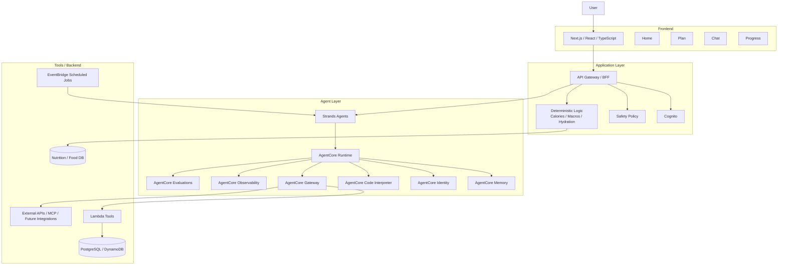

承知いたしました。
**Strands Agents + Amazon Bedrock AgentCore 前提**で、さっきの構成を更新します。
このPDFでは、Strands Agents をエージェント実装フレームワーク、AgentCore を Runtime / Memory / Identity / Code Interpreter / Gateway / Observability / Evaluations などの実行基盤として扱っています。さらに、Lambda をツール実装、EventBridge を定期実行、Cognito を認証に使う構成になっています。

## 更新後の正しい技術スタック

```text
Frontend
- Next.js
- React
- TypeScript
- Tailwind CSS

Agent Implementation
- Strands Agents

Agent Platform
- Amazon Bedrock AgentCore Runtime
- Amazon Bedrock AgentCore Memory
- Amazon Bedrock AgentCore Identity
- Amazon Bedrock AgentCore Code Interpreter
- Amazon Bedrock AgentCore Gateway
- Amazon Bedrock AgentCore Observability
- Amazon Bedrock AgentCore Evaluations

Backend / Tools
- AWS Lambda
- Amazon EventBridge
- Amazon API Gateway
- Amazon Cognito

Data
- PostgreSQL or DynamoDB
- Nutrition / Food DB
- Progress / Profile Store
```

## 更新後の構成図



## 役割の切り分け

### Next.js / React

ユーザーが触るUIです。
Home、Plan、Chat、Progress をここで作ります。

### Strands Agents

**エージェント実装そのもの**です。
PDFでも、Strands Agents を AgentCore Runtime 上で動く実装レイヤーとして置いています。

### AgentCore Runtime

**エージェントの実行基盤**です。
メインエージェント、サブエージェント、パイプラインエージェントをここで回します。

### AgentCore Memory

短期記憶・長期記憶です。
食の嗜好、嫌いな食材、夜食傾向、飲酒傾向、過去のプラン反応などを保持する層です。

### AgentCore Identity

認証・認可です。
個人データを扱うので必須です。PDFでも Identity を明示しています。

### AgentCore Code Interpreter

コード実行サンドボックスです。
グラフ生成や、将来的な栄養分析、ログ集計、簡易レポート生成に使えます。PDFでも Skills と Code Interpreter を組み合わせて制御性と柔軟性を出しています。

### AgentCore Gateway

ツール接続口です。
meal DB、progress API、profile API、将来のGoogle Fit系連携の入口になります。

### Lambda

**ツール実装**です。
PDFでも Lambda をエージェントツール実装やパイプラインエージェント実行に使っています。あなたのサービスでも、

- meal swap 候補取得
- plan 生成補助
- progress 集計
- weekly review 作成
  を Lambda ツール化できます。

### EventBridge

定期実行です。
週次レビュー生成、リマインド、定期チェックインに使えます。PDFでも定期実行用途で使っています。

## あなたのフィットネストレーナーサービス向けに残す部分

```text
採用する
- Strands Agents
- AgentCore Runtime
- Memory
- Identity
- Gateway
- Observability
- Evaluations
- Lambda
- EventBridge
- Cognito
```

## 最終版

一言で言うと、更新後はこうです。

**Next.js でサービスを作り、Strands Agents でエージェントを実装し、Amazon Bedrock AgentCore で実行・記憶・認証・ツール接続・観測・評価を担う。**
